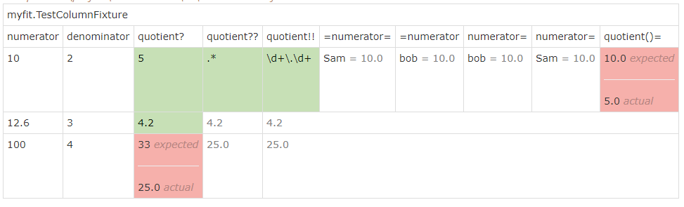
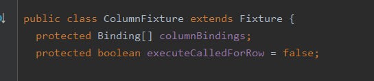

话不多说，从实例入手：
运行结果：
<br>
fitnesse脚本：
``` java
|myfit.TestColumnFixture|
|numerator|denominator|quotient?|quotient??|quotient!!|=numerator=|=numerator|numerator=|numerator=|quotient()=|
|10|2|5|.*|\d+\.\d+|Sam|bob|bob|Sam|Sam|
|12.6|3|4.2|||
|100|4|33|||
```
自定义的fixture类代码：
```java
package myfit;

import fit.ColumnFixture;

public class TestColumnFixture extends ColumnFixture {
private double numerator;
private double denominator;

    public double quotient() {
        return numerator / denominator;
    }

    public double getNumerator() {
        return numerator;
    }

    public void setNumerator(double numerator) {
        this.numerator = numerator;
    }

    public double getDenominator() {
        return denominator;
    }

    public void setDenominator(double denominator) {
        this.denominator = denominator;
    }
}
```
看到这，略思考一下，表里的数据是怎么处理的？前三列还好理解，官方的示例也有，无非就是简单的设置对应类的属性值并且调用方法再对比结果。但是后面啥意思呢？别急，读完这篇文章后就理解了。

column fixture 处理测试表的时候，是从上到下一行一行扫描读取处理的。第一行是这个表对应的自定义fixture类的全限定名，第二行是表头headers，代表数据的处理方式。剩下的就是对应的text数据。
进入到ColumnFixture类里的时候我们可以看到有俩个属性如下图：<br>
<br>
columnBindings 这个属性是在表初始化的时候用来绑定headers的，每个header经过解析都会绑定一个具体的继承Binding的子类，不同header的Binding子类对每一列的数据的处理方式不一样。
首先来分析如何解析header并绑定Binding的：
Binding的核心代码：
```java
public static Binding create(Fixture fixture, String name) throws Throwable {
Binding binding = null;

    if (name.startsWith("="))
      binding = new SaveBinding();
    else if (name.endsWith("="))
      binding = new RecallBinding();
    else if (regexMethodPattern.matcher(name).matches())
      binding = new RegexQueryBinding();
    else if (methodPattern.matcher(name).matches())
      binding = new QueryBinding();
    else if (fieldPattern.matcher(name).matches())
      binding = new SetBinding();

    if (binding == null)
      binding = new NullBinding();
    else
      binding.adapter = makeAdapter(fixture, name);

    return binding;
}
```
这里俩个参数，fixture是fixture是自己的那个自定义类也就是TestColumnFixture对象(用于给Binding里面的adapter保存起来，设置TestColumnFixture对象属性的数据或者反射TestColumnFixture对象的方法)，name代表header的文本。
里面有个if else逻辑也很好理解了，首先判断header是否"="开头，如果是的话就是SaveBinding，然后再判断是否以"="结尾，是的话就是RecallBinding，后面不再赘述。Binding的作用就是根据不同的header的格式，保存不同的TypeAdapter使用处理对应列的数据并渲染结果的行为，例如实例里的header =numerator= 以及 =numerator 都满足第一个判断，因此就会使用SaveBinding。后面就是makeAdapter生成一个TypeAdapter对象，TypeAdapter封装了当前的fixture对象，以及对应header的Field或者Method，以及返回类型，是否正则匹配等等，在这个类里面进行各种反射调用以及结果比较，makeAdapter的代码如下：
```java
private static final Pattern regexMethodPattern = Pattern.compile("(.+)(?:\\?\\?|!!)");
private static final Pattern methodPattern = Pattern.compile("(.+)(?:\\(\\)|\\?|!)");
private static final Pattern fieldPattern = Pattern.compile("=?([^=]+)=?");
private static TypeAdapter makeAdapter(Fixture fixture, String name) throws Throwable {
    Matcher regexMatcher = regexMethodPattern.matcher(name);
    if (regexMatcher.find())
        return makeAdapterForRegexMethod(name, fixture, regexMatcher);
    else {
        Matcher methodMatcher = methodPattern.matcher(name);
        if (methodMatcher.find())
            return makeAdapterForMethod(name, fixture, methodMatcher);
        else
            return makeAdapterForField(name, fixture);
    }   
}
```
这一块略复杂，意思是根据正则表达式匹配header来判断，来一一分析

- regexMethodPattern匹配的话，header本身代表一个方法(获取方法名的时候会去掉后面的俩个叹号或者俩个问号)，而当前列下面的text当成正则表达式，通过反射调用方法得到值并将值跟text进行正则匹配，匹配则测试通过。例如上面实例的quotient??和quotient!! 下面的.*和\d+\.\d+都是正则表达式，去匹配quotient方法返回的5
- methodPattern匹配，header本身代表一个方法(获取方法名的时候会去掉后面的问号)，这个就是简单的调用方法和比较结果。可以有多种表达方式，只要匹配methodPattern就行，例如quotient?，quotient()，quotient!
- fieldPattern匹配，header本身代表一个属性，例如=numerator=，=numerator，numerator= 都匹配，虽然都是从numerator属性里面操作数据，但是等号放在前面和后面实际是不同的。前面讲Binding的时候就直到，优先判断等号是不是在前面，再判断是不是最后面来决定Binding会是SaveBinding还是RecallBinding。

SaveBinding是干什么的呢，源码如下：
```java
public static class SaveBinding extends Binding {
    @Override
    public void doCell(Fixture fixture, Parse cell) {
        try {
            //TODO-MdM hmm... somehow this needs to regulated by the fixture.
            if (fixture instanceof ColumnFixture)
                ((ColumnFixture) fixture).executeIfNeeded();

            Object valueObj = adapter.get(); //...might be validly null
            String symbolValue = valueObj == null ? "null" : valueObj.toString();
            String symbolName = cell.text();
            Fixture.setSymbol(symbolName, symbolValue);
            cell.addToBody(Fixture.gray(" = " + symbolValue));
        }
        catch (Exception e) {
            fixture.exception(cell, e);
        }
    }
}
```
意思是，拿到adapter的值作为symbolValue，而列下面的数据则作为symbolName，此时就是一个键值对entry，symbolName对应symbolValue，通过Fixture类的静态方法setSymbol保存起来。有兴趣的可以进去setSymbol方法看看源码，无非就是一个map保存数据作为缓存。然后将symbolValue拼接到本来就有的text后面，那个text当然就是symbolName了。例如fitnesse脚本里的=numerator=，下面一行同一列对应的text就是Sam，于是就是Sam=adapter的值。此时应该对column fixture的设计有点感觉了吧。为什么它要把Binding的逻辑和TypeAdapter的逻辑分开？header只要是等于号开头，就会用到SaveBinding，而adapter则是由三个正则表达式来判断这个header是属性还是方法还是正则方法匹配。假如我们就有一个header，是=numerator，就会匹配到fieldPattern，或者=numerator?，就会匹配到methodPattern，或者=numerator??，就会匹配到regexMethodPattern，得到不同adapter，从adapter得到的值就不一样啦。但不管得到什么值，最终都会保存在Fixture类的symbols map里面以备后用，并且将adapter得到的symbolValue渲染出来。

RecallBinding，源码如下
```java
public static class RecallBinding extends Binding {
    @Override
    public void doCell(Fixture fixture, Parse cell) throws Exception {
        String symbolName = cell.text();
        if (!Fixture.hasSymbol(symbolName))
            fixture.exception(cell, new FitFailureException("No such symbol: " + symbolName));
        else {
            String value = (String) Fixture.getSymbol(symbolName);
            if (adapter.field != null) {
                adapter.set(adapter.parse(value));
                cell.addToBody(Fixture.gray(" = " + value));
            }
            if (adapter.method != null) {
                cell.body = value;
                fixture.check(cell, adapter);
            }
        }
    }
}
```
这个意思是，用当前header列下面的text数据作为symbolName从symbols 缓存里拿出symbolValue，如果adapter里面由field属性，则把symbolValue set到属性进去并渲染出来，如果有method，就调用method得到返回值和symbolValue比较。例如实例里的 numerator= 和 quotient()=。numerator=的adapter肯定是满足fieldPattern，adapter里面会保存numerator属性，下面的渲染结果是Sam = 10.0，代表从symbols 缓存拿出symbolName为Sam的值10，并set到属性里面。而从fitness 脚本可以看到，quotient()=下面的text是Sam，而它的adapter肯定是满足 methodPattern，意思就是从symbols 缓存拿出symbolName为Sam的值10，并和 quotient方法返回的结果5比较，5!=10，结果显示为失败。拓展思维一下，我们甚至还可以加一列为quotient!!=，下面的text为某一个symbolName，而对应的symbolValue必须为正则表达式，去匹配quotient这个方法返回的值。

剩下三个Binding则比较简单，代码如下
```java
public static class SetBinding extends Binding {
		@Override
		public void doCell(Fixture fixture, Parse cell) throws Throwable {
			if ("".equals(cell.text()))
				fixture.handleBlankCell(cell, adapter);
			adapter.set(adapter.parse(cell.text()));
		}
	}

	public static class QueryBinding extends Binding {
		@Override
		public void doCell(Fixture fixture, Parse cell) {
			fixture.check(cell, adapter);
		}
	}

	public static class RegexQueryBinding extends Binding {
		@Override
		public void doCell(Fixture fixture, Parse cell) {
			fixture.check(cell, adapter);
		}
	}
```
QueryBinding和RegexQueryBinding就是直接调用adapter里面的逻辑并比较。SetBinding则是拿出对应header下面的text并更新属性值。

总结：SaveBinding就是把header格式得到的数据作为value并对应header列下的text作为key保存在键值对缓存里并渲染出来，RecallBinding则是从键值对缓存里把text作为key对应的value拿出来作为真正的text，然后再去根据header的格式去进行处理(如果header是属性类型，则更新属性的值，如果是方法类型，则调用方法比较结果)