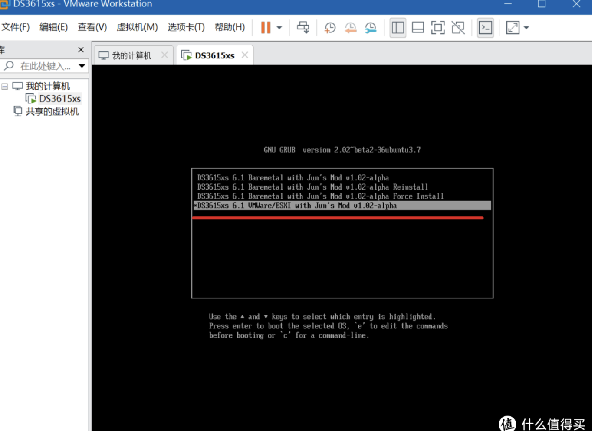
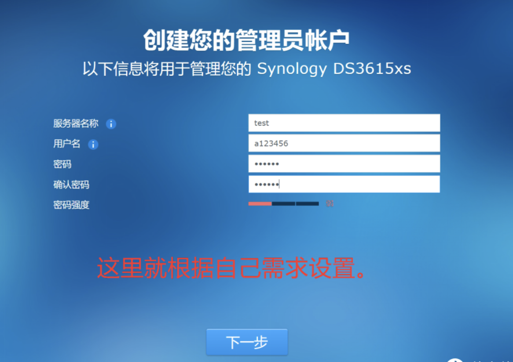

## 黑群晖折腾经验
### 背景
!> 偶然得知群晖NAS这玩意，就想弄个玩玩，但是正版的着实太贵，动辄3k以上，于是在闲鱼收购了一个二手主机200RMB，自己来折腾个虚拟机安装黑群晖玩玩
教程地址：https://post.smzdm.com/p/awx4e5gk/
### 踩过的坑
教程写的不错，很详细又清晰，但是不可避免的踩了坑，这里做一下经验补充。 
 
运行虚拟机的时候，这一步过的很快，一不留神就会没注意到，导致后面失败，因此在运行虚拟机的时候，需要鼠标点击虚拟机的界面进入虚拟机，
然后一直按上下的方向键，这样才会停留在这个界面，选择了正确的选项后按enter。

下一个就是这个界面，填写了后要记录下来用户名和密码，我就是后面不记得了用户名，导致浪费了一些时间。
 

按照教程成功的启动并且可以在本机访问了，确实蛮爽的，接下来就遇到了最花时间也就是最深的一个坑，是关于其他设备连接群晖的
1. 无法通过wifi共享，不确定是什么原因，这是最开始遇到的问题，也可能被我后面解决了，我的主机本来是连的pdd买的十几块钱的无线网卡，后来直接网线连接，速度也更快
2. 然后就是本来是在局域网可以连接外部设备了，手机同步着照片的时候突然又不能通过局域网连接了，后面网上各种搜，依次关闭防火墙不管用，直接重装群晖系统不管用，重装了win10系统还是不管用，后面才想起试试ping一下群晖所在的主机，才发现根本ping不同，一直显示`Request timeout for icmp_seq`，网上各种搜，用cmd指令永久关闭防火墙、设置固定ip、重设网络等，都不管用，最后思考觉得可能是路由器的问题，重启了路由器，终于好了。

### 总结
后面又试着同步照片，发现又出现同样的问题，猜测可能是路由器的保护策略生效，封锁了群晖所在的主机ip地址吧